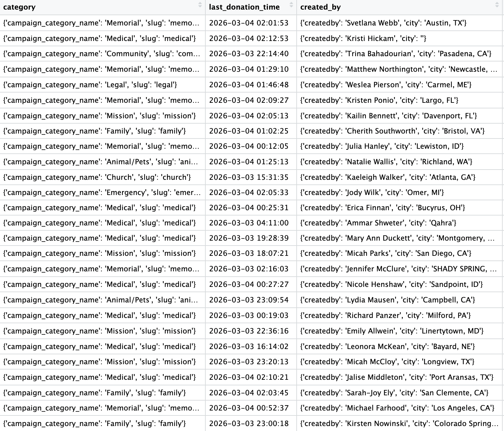

# GiveScrapeGo: A GiveSendGo Scraper

This is a Python toolkit for collecting and analyzing publicly available data from [GiveSendGo](https://givesendgo.com), including individual campaign donations and the full site-wide campaign directory. Built for accountability journalism, civic research, and transparency.

***Note***: Everything collected is publicly visible on GiveSendGo without an account. No private data is accessed.


---

## Use Cases

- **Accountability journalism:** Tracking who funds politically motivated campaigns
- **Research:** Analyzing donor networks, comment sentiment, and fundraising patterns over time
- **Platform-wide analysis:** Using the campaign directory scraper to identify trends across all of GiveSendGo

## Scripts

### `campaign_scraper/script.py`

Collects every donation record from a specific GiveSendGo campaign. For each donation, it captures the donor name, amount, timestamp, and any comment left by the donor.

### `all_campaigns/script.py`

Scrapes GiveSendGo's full campaign directory by paginating through the `/api/v2/campaigns` endpoint. Automatically detects the total number of pages on the first request and iterates through all of them, collecting metadata for every campaign on the site.

---

## Repository Structure

```
├── all_campaigns/               # Donation scraper for all campaign metadata
│   ├── results/
│   |   └── all_campaigns.csv
|   └── script.py
├── campaign_scraper/            # Donation scraper for a single campaign
│   ├── results/
│   │   └── all_donations.csv
│   ├── requirements.txt
│   └── script.py
└── README.md
```
